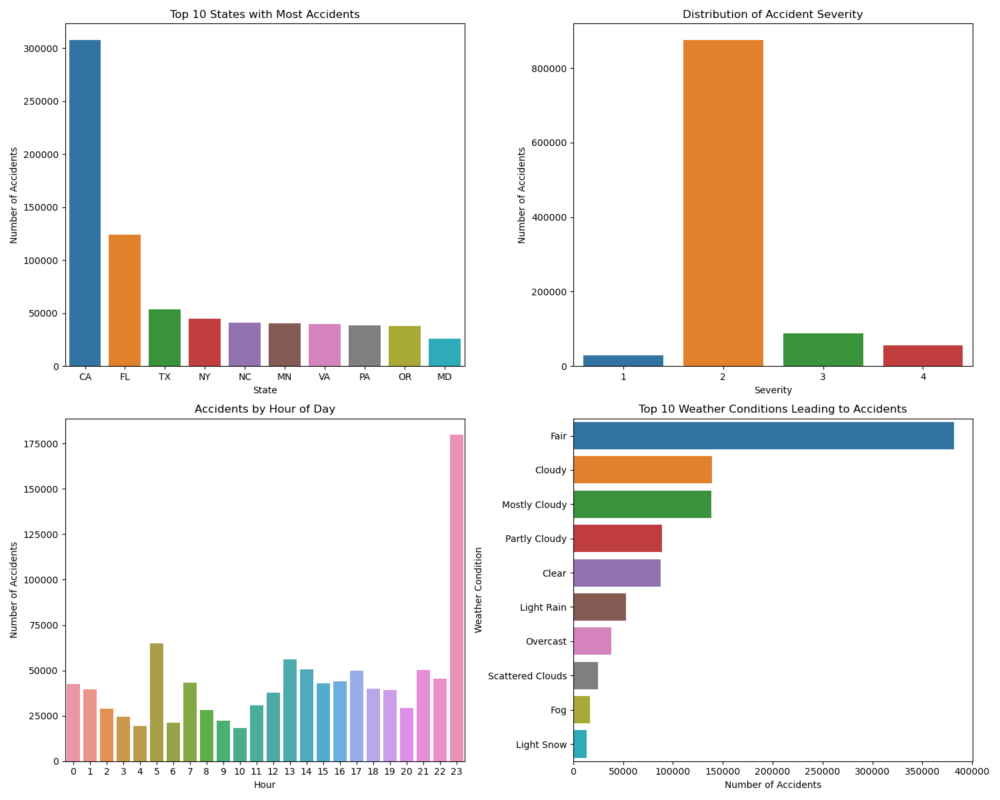

# PRODIGY_DS_05
Analysis and visualization of US traffic accident data.
# US Accident Analysis & Hotspot Mapping 🚦

This project analyzes US accident data to identify patterns based on weather, road conditions, and time of day. It also visualizes accident hotspots using Folium.

## 📌 Features
✔️ Accident severity and time-based analysis  
✔️ Weather and road condition impact on accidents  
✔️ Heatmap visualization of accident hotspots  

## 📂 Folder Structure
- `accident_analysis.py` → Main Python script  
- `hotspot_map.html` → Interactive accident hotspot map  
- `accident_analysis.png` → Combined output image of all graphs  
- `requirements.txt` → Required Python dependencies  

## 🔧 Installation
1. Clone the repository:
   ```bash
   git clone https://github.com/your-username/US-Accident-Analysis.git
   cd US-Accident-Analysis
2. ## Requirements
   ```
   pip install -r requirements.txt
## Output Files

### Accident Analysis Visualization  
The script generates accident trend visualizations and saves them as `accident_analysis.png`.



### Accident Hotspot Map  
An interactive accident hotspot map is generated and saved as `hotspot_map.html`.  
Open it in a browser to explore accident-prone areas.

- **Windows:** Double-click `hotspot_map.html` to open  
- **Mac/Linux:** Run  
  ```bash
  open hotspot_map.html  # Mac  
  xdg-open hotspot_map.html  # Linux  

## 📂 Dataset
The dataset used for this analysis is sourced from Kaggle:
🔗 [US Accidents Dataset](https://www.kaggle.com/datasets/sobhanmoosavi/us-accidents)

📄 Description:
This dataset contains records of road accidents in the United States, including information on severity, location, weather conditions, and time of occurrence.

